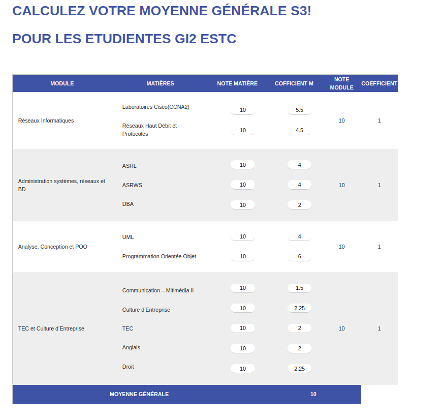

# Student GPA Calculator
## Overview
This web project is designed to assist students in calculating their Grade Point Average (GPA) for the third semester (S3). It has been developed as part of my studies at the Ecole Supérieure de Technologie.

## Features
- Calculate GPA for the third semester.
- User-friendly interface for easy input of grades.
- Clear display of GPA results.

## Usage

Here is an example of how to use my project:

## Contributing

If you would like to contribute to this project, please follow these steps:

1. Fork the repository
2. Create a new branch: `git checkout -b my-new-feature`
3. Make your changes and commit them: `git commit -am 'Add some feature'`
4. Push to the branch: `git push origin my-new-feature`
5. Create a new pull request

## License

This project is licensed under the MIT License. See the [LICENSE](LICENSE) file for details.